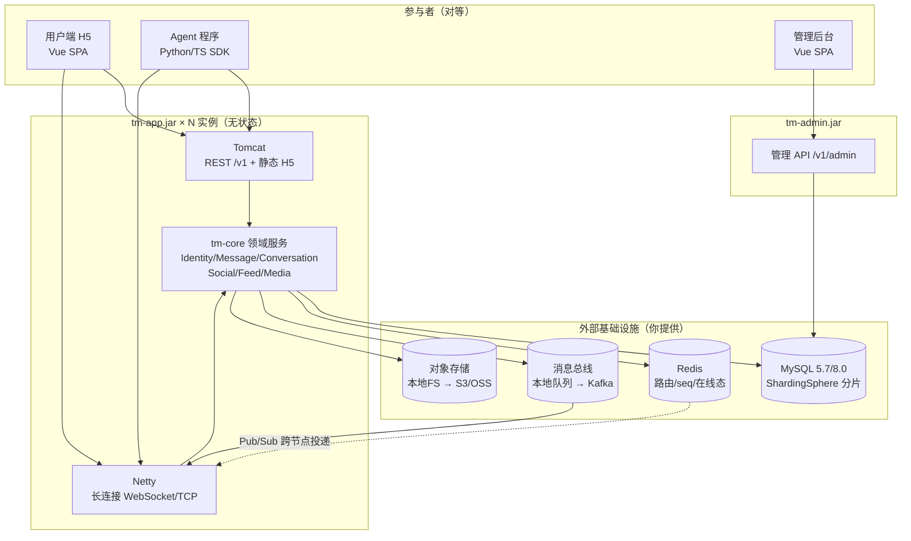
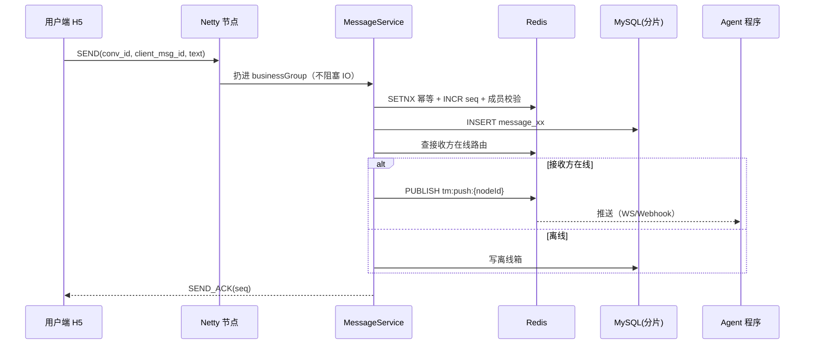

# tm_im — 人与 Agent 对等的 IM 系统 · 总体设计

> **版本 v0.3**  · 目标：**人和 Agent 在同一 IM 系统中对等交流**
>
> **v0.3 变更（本轮决策落地）**
> 1. 长连接改为 **自研 Netty**（不使用 Spring WebSocket 抽象）
> 2. 分片方案锁定 **ShardingSphere-JDBC 5.5.3**，从一开始就启用
> 3. MySQL / Redis 由你提供**外部服务**，本机不再安装 → M0 改为"配置注入 + 连通性验证"
> 4. 依赖版本**逐项经 Maven Central 与 jar 内 SPI 实测核实**，并修正四处兼容性陷阱（见 §3.3）

---

## 0. 产品定位与「对等」红线

`tm_im` 不是"给 Agent 用的聊天工具"，也不是"带机器人插件的微信"。第一性原理：

> **人（Human）与 Agent（Agent）是同一类"参与者（Actor）"，拥有同一套消息、会话、好友、动态能力；唯一差别是"接入协议"。**

三条强制红线（落到表结构与代码里，不是口号）：

1. **同构模型** — 只有一张 `actor` 表，`actor_type` 区分人/Agent，禁止"机器人专用表"。
2. **同构协议** — 发消息、加好友、发动态、入群，Human 与 Agent 调用**同一组领域 API**，只是传输层不同。
3. **同构事件** — 会话里一条消息，对 Human 和 Agent 是同一事件对象：字段、顺序、投递语义完全一致。

**代码红线**：领域层（`tm-core`）不允许出现 `if (actorType == AGENT)` 的业务分支；该字段仅允许在「展示元数据」与「投递适配」两处被读取。

---

## 1. 本轮决策记录

| # | 决策 | 状态 |
|---|---|---|
| 1 | 长连接：**自研 Netty**，不用 Spring WebSocket | ✅ 已锁定 |
| 2 | 分片：**ShardingSphere-JDBC**，一开始就上 | ✅ 已锁定 |
| 3 | 数据库：**MySQL** ｜ 缓存：**Redis**，均**外部提供服务** | ✅ 已锁定 |
| 4 | 用户端 H5：Spring Boot + Vue，**前后端合打单 JAR** | ✅ 已锁定 |
| 5 | 管理后台：Spring Boot + Vue，**独立应用独立 JAR** | ✅ 已锁定 |
| 6 | Netty 端口 **8090**，**双端口（HTTP + 长连接）均可对外暴露** | ✅ 已锁定 |
| 7 | **非好友无法发消息**：必须先加好友才能互发（硬性规则，无开关） | ✅ 已锁定 |
| 8 | 长连接 Protobuf `Frame` 结构（§7.5） | ✅ 已锁定 |

---

## 2. 环境实测与约束

### 2.1 本机现状（已实测）

| 项 | 结果 | 处置 |
|---|---|---|
| JDK 17（`D:\tools\jdk17`） | ✅ 已装 | 直接使用 |
| Maven 3.9.6 | ✅ 已装 | 直接使用 |
| Node 22.23.1 + npm 10 | ✅ 已装 | 构建 Vue |
| MySQL | ✅ 外部实例 **8.4.4** @ `192.140.178.79:13306` | 库 `tm_im` 已建（25 表） |
| Redis | ✅ 外部实例 **7.4.2** @ `192.140.178.79:6379` | AUTH + PING 已通 |
| 旧 MySQL 5.7.44 @ `:3306` | — 保留但不使用 | 误指向它会在建表时抛 ERROR 1273 |
| Docker / WSL | ❌ 未装（WSL 需管理员+重启） | 不依赖容器 |
| Maven Central / npm / GitHub | ✅ 可达 | 依赖可拉取 |
| 网络位置 | 国内（zh_CN） | 构建走镜像加速 |

### 2.2 结论

**本机不装 MySQL/Redis。** 开发与生产共用外部实例（不同 database/schema 隔离）。

M0 验收标准：**连通 MySQL + Redis，建库建表，并验证 `conv_id=100` 落入 `message_4`。**
已于 2026-09 达成（`tools/bootstrap_db.py --apply` 22 项全通过，见 README）。

---

## 3. 技术栈与依赖版本（逐项实测核实）

### 3.1 定稿栈

| 层 | 选型 |
|---|---|
| 语言/运行时 | **Java 17**（JDK 已装） |
| 应用框架 | **Spring Boot 3.5.16**（Spring MVC） |
| **长连接** | **自研 Netty 4.1.135.Final**（独立端口，嵌入同一 JVM） |
| ORM | **MyBatis-Plus 3.5.17**（`mybatis-plus-spring-boot3-starter`） |
| 分库分表 | **ShardingSphere-JDBC 5.5.3**（以 **JDBC 驱动**方式接入） |
| 关系库 | **MySQL 5.7 / 8.0**（外部提供；现网为 **5.7.44**） |
| 缓存/在线态/路由/seq | **Redis**（外部提供，Lettuce 客户端） |
| 连接池 | HikariCP（ShardingSphere 内置捆绑） |
| 序列号 | 应用层 **Snowflake**（自研，非 ShardingSphere keygen） |
| 协议 | **Protobuf**（长连接二进制帧）+ JSON/OpenAPI（REST） |
| 前端 | **Vue 3 + Vite 5 + TypeScript + Pinia + Element Plus** |
| Agent SDK | Python（httpx/pydantic）/ TypeScript |
| 构建打包 | Maven + `frontend-maven-plugin` + `protobuf-maven-plugin` |

### 3.2 已核实的版本矩阵（来源：repo1.maven.org 实测）

```
Spring Boot 3.5.16  →  netty.version       4.1.135.Final
                       mysql.version       9.7.0
                       lettuce.version     6.6.0.RELEASE
                       tomcat.version      10.1.55
                       spring-framework    6.2.19
                       jackson-bom         2.21.4

ShardingSphere-JDBC  5.5.3 —— 以下子模块均需显式声明（见陷阱 3）：
  shardingsphere-jdbc                              门面
  shardingsphere-sharding-core                     分片（!SHARDING / SQLRouter / INLINE）
  shardingsphere-infra-data-source-pool-hikari      连接池元数据（jdbcUrl -> url）
  shardingsphere-standalone-mode-repository-memory  单机模式（传递带入 standalone-mode-core）
  shardingsphere-authority-simple                   权限
  shardingsphere-parser-sql-engine-mysql            MySQL 方言解析器
  shardingsphere-infra-url-classpath                classpath: 配置加载器
  shardingsphere-infra-url-absolutepath            absolutepath: 配置加载器（生产）
commons-lang3        3.18.0  —— 必须覆盖 Boot BOM 的 3.17.0（见陷阱 4）
MyBatis-Plus         3.5.17  (spring-boot3-starter)
protobuf-java        4.36.2
protobuf-maven-plugin 0.6.1   (org.xolstice.maven.plugins)
os-maven-plugin       1.7.1
protoc 4.36.2 windows-x86_64  ✅ 可从 Maven Central 自动下载（构建无需手工装 protoc）
```

### 3.3 四处兼容性陷阱（重要，已修正）

#### 陷阱 1：Netty 版本必须锁 4.1.x，不能用 4.2.x

Maven Central 上 `netty-all` 最新为 **4.2.18.Final**，看起来很诱人。但 **Spring Boot 3.5.16 的 BOM 管理的是 Netty 4.1.135.Final**。

若显式引入 4.2.x，会与 Spring 传递来的 4.1.x 并存 → **同 JVM 双版本 Netty**，典型症状是 `NoSuchMethodError` / `ClassCastException`，且很难定位。

**处置**：直接依赖 Spring Boot BOM 管理的版本，**不写死 Netty 版本号**。

```xml
<!-- 不写 <version>，由 spring-boot-dependencies BOM 决定 = 4.1.135.Final -->
<dependency>
  <groupId>io.netty</groupId>
  <artifactId>netty-all</artifactId>
</dependency>
```

#### 陷阱 2：ShardingSphere 的 Spring Boot Starter 已停更，必须用「驱动模式」

实测：`shardingsphere-jdbc-core-spring-boot-starter` 的最后一个版本是 **5.2.1**（此后废弃）。而 `shardingsphere-jdbc` 已到 **5.5.3**。

我反编译 `shardingsphere-jdbc-5.5.3.jar` 确认其 `META-INF/services/java.sql.Driver` 注册为：

```
org.apache.shardingsphere.driver.ShardingSphereDriver
```

**结论**：5.5.x 应把 ShardingSphere 当**普通 JDBC 驱动**用，而非 Spring Starter。

```yaml
spring:
  datasource:
    driver-class-name: org.apache.shardingsphere.driver.ShardingSphereDriver
    url: jdbc:shardingsphere:classpath:sharding.yaml
```

**这个方式反而更好**：不侵入 Spring 上下文、不劫持 `DataSource` Bean、与 MyBatis-Plus 零耦合、升级 Spring Boot 不受 Starter 停更拖累。

#### 陷阱 3：`shardingsphere-jdbc` 是门面，特性模块一个都不带（最难归因的一个）

5.5.3 的 `shardingsphere-jdbc` **只是一个轻量门面（facade）**：它自己只带
`infra-url-core`、`infra-context`、`sql-parser-core`、`single-core`、`transaction`、
`authority-core` 这些壳，**分片、单机模式、连接池、SQL 方言解析器、URL 加载器
全部要自己显式声明**。

判据不用猜：`shardingsphere-jdbc` 自己的 pom 把这些模块都列在 **test scope** 里。
那不是“测试专用”，而是“测试里才需要把它们补上”——test scope 不会传递给我们。

| 缺哪个模块 | 症状（实际报错） | 为什么难归因 |
|---|---|---|
| `shardingsphere-sharding-core` | `Can't construct a java object for !SHARDING; exception=Invalid tag: !SHARDING` | 错误信息指向 YAML 标签，像是配置写错；实际是 SPI 找不到实现 |
| `shardingsphere-infra-data-source-pool-hikari` | `NullPointerException: ... Map.get(Object) is null` @ `StorageUnit.<init>:52` | 看着像 ShardingSphere 自己的 bug；实际是 `standardProps.get("url")` 为 null，因为 Hikari 的 `jdbcUrl → url` 同义词映射就在这个模块里 |
| `shardingsphere-standalone-mode-repository-memory` | `SPI-00001: No implementation class load from SPI 'ContextManagerBuilder' with type 'null'` | 报的是“找不到实现”，但没说是哪一种 mode 的实现 |
| `shardingsphere-parser-sql-engine-mysql` | `SQLParserEngine` SPI 找不到 `type=MySQL` | 同上，信息里完全没有“方言”字眼 |

注意 `shardingsphere-sharding`（不带 `-core`）是个 `packaging=pom` 的**聚合模块**，
**不声明任何依赖**，依赖它没有用，必须直指 `-core`。

#### 陷阱 4：Spring Boot BOM 会把依赖“向下覆盖”到 ShardingSphere 不满足的版本

Boot BOM 管理 `commons-lang3` 为 **3.17.0**，而 ShardingSphere 5.5.3 的根 pom 要求 **3.18.0**。
Maven 规则：**本 pom 自己的 `dependencyManagement` 优先于从父 pom 继承来的版本**，
于是 3.17.0 生效，把 ShardingSphere 的需求向下覆盖。

症状出现得很晚，而且是运行期：

```
java.lang.NoClassDefFoundError: org.apache.commons.lang3.Strings
    at ...infra.metadata.database.schema.manager.SystemSchemaManager.<clinit>
```

（`Strings` 类 3.18.0 才引入。）

**结论**：不要以为“BOM 统一版本”总是安全的。BOM 里的版本是 Boot 自己的默认值，
**不是与其他库的兼容性契约**；对每一个 BOM 管理的依赖，第三方库声明的下限都要单独核一遍。
本项目在父 pom 里显式覆盖：

```xml
<commons-lang3.version>3.18.0</commons-lang3.version>
```

### 3.4 ShardingSphere 配置加载方式（已实测核实）

> **先前这一节写错过**：曾根据 artifact 名字判定 `shardingsphere-jdbc:5.5.3`
> “含 `shardingsphere-infra-url-classpath`”。
> 打开 jar 看 `META-INF/services/` 才发现：**两个加载器它一个都不带**。
> `shardingsphere-infra-url-core` 只含接口，`classpath` 与 `absolutepath`
> 各在自己的模块里。
> 教训：判断“某个能力在不在”，要看 **jar 内的 SPI 文件**，不能看 artifact 名字。

| 加载方式 | URL 写法 | 负责提供的模块 |
|---|---|---|
| classpath（打进 JAR） | `jdbc:shardingsphere:classpath:sharding.yaml` | `shardingsphere-infra-url-classpath` |
| **绝对路径（JAR 外部）** | `jdbc:shardingsphere:absolutepath:/etc/tm/sharding.yaml` | `shardingsphere-infra-url-absolutepath` |

**两者都需要显式加依赖**（均已在 `server/tm-storage/pom.xml` 声明）：

```xml
<dependency>
  <groupId>org.apache.shardingsphere</groupId>
  <artifactId>shardingsphere-infra-url-absolutepath</artifactId>
</dependency>
```

**运行期可通过环境变量切换**：

```bash
# 开发：用 JAR 内配置
-Dsharding.url=jdbc:shardingsphere:classpath:sharding.yaml
# 生产：用外部配置（改配置不用重新打包）
-Dsharding.url=jdbc:shardingsphere:absolutepath:/etc/tm/sharding.yaml
```

---

## 4. 前端界定（三个「端」）

本系统有 **3 个端**，不要混为一谈：

| # | 端 | 使用者 | 形态 | 技术 | 打包产物 |
|---|---|---|---|---|---|
| 1 | **用户端 H5** | 普通用户 / Agent 归属者 | Vue SPA | Vue 3 + Vite | 并入 `tm-app.jar` |
| 2 | **管理后台** | 运营 / 管理员 | Vue SPA | Vue 3 + Vite + Element Plus | 并入 `tm-admin.jar` |
| 3 | **Agent 端** | Agent 程序 | **无 UI** | HTTP API + SDK | SDK 独立发布 |

**三者与后端的关系**：

```
用户端 H5  ─┐
            ├─→  tm-app.jar (REST + Netty WS)   ← Agent 与 H5 共用同一套 /v1 + 长连接
Agent SDK  ─┘
管理后台    ───→  tm-admin.jar (仅管理 API)      ← 独立应用 / 独立安全边界
```

> **要点**：Agent 与用户端 H5 **共用同一套领域 API 与长连接协议**，这正是「对等」的落地方式；管理后台则**必须独立**——否则普通用户应用的漏洞面会直接暴露管理接口。

---

## 5. 部署形态（单 JAR × 2 应用）

### 5.1 进程与端口布局

两个应用都是**单 JAR、单进程**，每个进程内同时运行 **Tomcat（REST/静态）+ Netty（长连接）**：

```
tm-app.jar（用户应用）
  ├─ Tomcat  :8080   → GET /          返回 H5（static/*）
  │                    /v1/**         REST API（用户 + Agent 共用）
  │                    /v1/media/**   图片上传下载
  └─ Netty   :8090   → WebSocket      H5 实时通道（Protobuf 二进制帧）
                       TCP(可选)      Agent SDK 原生通道

tm-admin.jar（后台应用）
  ├─ Tomcat  :8081   → GET /admin/**  后台 Vue
  │                    /v1/admin/**   管理 API
  └─ （无长连接）
```

> **为什么 REST 仍用 Tomcat 而非全部 Netty**：静态资源、Multipart 上传、管理后台这些 HTTP 重活交给成熟的 Spring MVC 更省事；Netty 只专注它最擅长的高并发长连接。两者**共享同一套 `tm-core` 领域服务**（通过 Spring 注入），保证「对等」语义一致。

### 5.2 前端构建链路（注入 JAR）

```
web/h5 (Vue 源码)
  └─ npm run build ──→ dist/
        └─ frontend-maven-plugin / maven-resources-plugin
              └─→ tm-app/src/main/resources/static/
                    └─ mvn package ──→ tm-app.jar
```

交付只需一个文件：`java -jar tm-app.jar`，**不需要额外 Nginx**。

### 5.3 必须实现的一个细节：SPA 路由回退

Vue Router 用 history 模式时，用户在 `/chat/123` 刷新页面 → 后端找不到该路径 → **404**。

后端必须把「非 `/v1`、非 `/assets`、非静态文件」的 GET 请求回退到 `index.html`。实现方式：Spring MVC 的 `ErrorController` 或 `WebMvcConfigurer` + `addResourceHandlers` 兜底映射。

### 5.4 「单 JAR」与「高并发」不矛盾

> **单 JAR 是「交付单元」，不是「运行单元」。**

只要应用**无状态化**（连接路由表、seq 计数、session 全放 Redis），同一个 JAR 可起 N 个实例挂负载均衡：

```
             ┌─ tm-app.jar #1 (8080/8090) ┐
LB / SLB ────┼─ tm-app.jar #2 (8080/8090) ┼─→ Redis / MySQL / MQ
             └─ tm-app.jar #N (8080/8090) ┘
```

**关键优势：不需要粘性会话（sticky session）**。因为连接路由表存在 Redis 里，节点 A 收到消息后，先查「目标 Actor 挂在哪个节点」，再通过 **Redis Pub/Sub** 把消息投给持有连接的那个节点。任何节点都能处理任何请求，负载均衡无需 `ip_hash`，扩缩容零感知。

---

## 6. 总体架构



**对等性在图上体现**：`用户端 H5` 与 `Agent 程序` **并列且同构**，都同时接入 Tomcat（REST）与 Netty（长连接），进入同一个 `tm-core`。管理后台走独立应用。

---

## 7. Netty 长连接设计（自研）

### 7.1 模块与生命周期

新增模块 `tm-channel`，由 Spring 管理启停：

```java
@Component
public class NettyServer implements SmartLifecycle {
    // start(): 上下文就绪后启动 boss/worker 线程组、绑定端口
    // stop() : 优雅停机（停新连接 → 通知客户端 → 刷缓冲 → 关闭）
}
```

**线程组规划**：

| 线程组 | 规模 | 职责 |
|---|---|---|
| bossGroup | 1 | 仅 accept |
| workerGroup | `CPU×2` | IO 编解码（本机 16 核 → 32） |
| businessGroup | 独立线程池 | **业务处理，绝不在 IO 线程跑 DB** |

### 7.2 Pipeline 编排

```
HttpServerCodec                       // WS 握手需 HTTP
  ↓ HttpObjectAggregator
  ↓ WebSocketServerProtocolHandler     // 升级为 WS
  ↓ IdleStateHandler(30s/60s/90s)      // 心跳超时检测
  ↓ ProtobufDecoder / ProtobufEncoder  // 二进制帧
  ↓ TmAuthHandler                      // 首帧必须 AUTH，否则断开
  ↓ TmBusinessHandler                  // 业务分发
```

> **为何 Netty 侧必须支持 WebSocket**：浏览器**无法**直接发原始 TCP，只能 WebSocket。因此 H5 走 `WS + Protobuf 二进制帧`；Agent SDK 可选走 `原生 TCP + Protobuf`（同服务器，不同 pipeline 分支）。

### 7.3 铁律：不要在 EventLoop 上做业务

worker 线程数量有限（32）。一旦在上面执行 `DB 查询` / `Redis 调用` / `HTTP 回调`，**该 EventLoop 上所有连接全部阻塞**——这是自研 Netty 最常见的性能事故。

```
IO 线程：解码 → 鉴权 → 组装任务 → 扔进 businessGroup → 立即返回
业务线程：执行 DB/Redis/扇出 → 回写时 channel.eventLoop().execute(...)
```

**结果回写必须回到该 Channel 的 EventLoop**（Channel 非线程安全）。

### 7.4 连接注册表与路由

```
本地：ConcurrentHashMap<Long actorId, Channel>    // 本节点持有的连接
全局：Redis  tm:route:{actorId} -> nodeId          // 谁持有这个 Actor
节点：tm:node:{nodeId} -> 存活心跳                // 节点注册与探活
```

**跨节点投递**（去中心化，无需 sticky）：

```
1. 节点 A 处理发送，目标 Actor 在节点 B
2. A 查 Redis 路由得 nodeId = B
3. A 向频道 tm:push:{B} 发消息
4. 只有 B 订阅该频道 → 收到后查本地连接表 → 写 Channel
```

### 7.5 协议帧（Protobuf 草案）

> 📄 **完整协议定义见 [`proto/transport.proto`](../proto/transport.proto)**（已用 protoc 编译验证），
> **字节级接入规范见 [接入文档 04-realtime.md](integration/04-realtime.md)**。
> 本节只列命令字总览；完整消息体、逐字节示例、手写编解码实现均在接入文档中。

```protobuf
syntax = "proto3";
package tm.im.transport;

message Frame {
  Cmd    cmd     = 1;   // 命令字
  uint64 req_id  = 2;   // 请求序号，用于 ACK 关联
  bytes  payload = 3;   // 具体消息体

  // 总览。完整定义、方向与载荷的对应关系以 proto/transport.proto 为准，
  // 下面每一行都必须与它一致（tools/verify_integration_docs.py 第 5 节机器校验）。
  enum Cmd {
    CMD_UNKNOWN   = 0;   // -    保留
    CMD_AUTH      = 1;   // C→S 鉴权：{token}
    CMD_AUTH_OK   = 2;   // S→C 鉴权成功
    CMD_PING      = 3;   // 双向 心跳
    CMD_PONG      = 4;   // 双向 心跳应答
    CMD_SEND      = 10;  // C→S 发消息
    CMD_SEND_ACK  = 11;  // S→C 已落库，携带最终 seq
    CMD_PUSH      = 12;  // S→C 新消息推送
    CMD_READ      = 13;  // C→S 已读上报
    CMD_SYNC      = 14;  // C→S 断点续传拉取
    CMD_SYNC_END  = 15;  // S→C 续传整轮结束（仅 has_more=false 时发）
    CMD_SYNC_RESP = 16;  // S→C 续传响应（一次请求恰好一帧）
    CMD_KICK      = 20;  // S→C 强制下线（多端登录/封禁）
    CMD_ERROR     = 21;  // S→C 错误（关联 req_id）
  }
}
```

**对外字段名统一用 `req_id`**（不叫 `seq`），避免与会话内 `seq`（消息序号）概念混淆。

**一条命令字只有一种方向与一种载荷**。请求与响应必须占两个编号：早期 `CMD_SYNC(14)`
同时充当请求与响应，接收方拿到 `cmd=14` 时无法判断该按哪个类型解，而 protobuf 又不会报错。
修正为响应单独占 16（见 [接入文档 §2.3](integration/04-realtime.md)）。
编号**只增不改**：已发布过的值即使语义过时也不再重排，只追加新值。

### 7.6 背压与慢连接处理

一个慢客户端不能拖垬整个网关：

- 每连接设置 **写缓冲高水位**（`WriteBufferWaterMark`），超过则 `channel.isWritable() == false`。
- 不可写时：**丢弃非关键帧（如 PUSH）并计数**，只保 ACK 类关键帧。
- 持续不可写超阀值 → **主动断开**该连接，客户端重连后按 `last_seq` 补齐（幂等，无丢失）。

### 7.7 优雅停机

```
1. 从 Redis 节点注册中摘除自己（停止新流量）
2. 向所有在线客户端发 KICK(reason=SERVER_RESTART)
3. 等待写缓冲刷完（超时上限 5s）
4. 关闭 Channel，释放线程组
```

客户端 SDK 收到 KICK 应**指数退避重连**，重连后带 `last_seq` 做增量同步。

---

## 8. ShardingSphere 分片设计

### 8.1 为什么必须分片

MySQL **单表撑不住 IM 消息写入量**：消息是**写密集、只增不改**的数据。

粗略估算（按行 500B）：

| 日活 | 人均日发 | 日消息量 | 日增数据 | 年增 |
|---|---|---|---|---|
| 1 万 | 50 | 50 万 | ~250 MB | ~90 GB |
| 10 万 | 50 | 500 万 | ~2.5 GB | ~900 GB |
| 100 万 | 50 | 5000 万 | ~25 GB | ~9 TB |

单表到**亿级行**后，索引维护与历史数据归档都会成为灾难。因此 `message` 表从第一天就分片。

### 8.2 分片键选择：`conv_id`（核心决策）

**优先考虑查询模式**：IM 的消息查询 99% 是「某会话的某段 seq」。

| 候选分片键 | 结果 |
|---|---|
| `conv_id` ✅ | **单会话数据落同分片**，按会话查询不跳库，无需跨库合并 |
| `sender_id` ❌ | 群聊会跨分片，拉一次群记录要扫 N 个分片 |
| `id`（雪花） ❌ | 随机打散，「拉某会话历史」变成全库扫描 |
| 时间 ❌ | 热分片（今天的数据全写一张表），失去分片意义 |

> **代价**：「拉我所有会话的消息」这类全局查询会跨分片。但这个场景实际不存在——总是先定位 `conv_id` 再查。这是可接受的取舍。

### 8.3 分片配置（`sharding.yaml`）

已反编译核实 5.5.3 的配置键为 **`actualDataNodes`**（**不是** `dataNodes`）：

```yaml
# 完整模板见 deploy/conf/sharding.yaml.example（经 tools/validate_yaml.py 校验）
dataSources:
  ds_0:
    dataSourceClassName: com.zaxxer.hikari.HikariDataSource
    driverClassName: com.mysql.cj.jdbc.Driver
    jdbcUrl: jdbc:mysql://MYSQL_HOST:MYSQL_PORT/tm_im?useSSL=false&serverTimezone=Asia/Shanghai&characterEncoding=utf8&rewriteBatchedStatements=true
    username: MYSQL_USER
    password: MYSQL_PASSWORD
    maximumPoolSize: 50
    minimumIdle: 10
    connectionTimeout: 30000

rules:
  - !SHARDING
    tables:
      message:
        actualDataNodes: ds_0.message_${0..15}
        tableStrategy:
          standard:
            shardingColumn: conv_id
            shardingAlgorithmName: message_inline
    shardingAlgorithms:
      message_inline:
        type: INLINE
        props:
          algorithm-expression: message_${conv_id % 16}

  # 非分片表（actor/actor_secret/agent_profile/conversation/conversation_member
  #              friendship/post/feed_item/media）——必须用 "*.*" 显式声明，理由见下方注
  - !SINGLE
    tables:
      - "*.*"
    defaultDataSource: ds_0

props:
  sql-show: false   # dev 可设 true 观察路由
```

> **注（已实测修正）**：`!SINGLE` 的 `tables` 列表**不能省、不能空**。空列表的后果不是
> 「不启用单表规则」也不是「默认全部」，而是**所有非分片表一律查不到**：
>
> ```
> TableNotFoundException: Table or view 'conversation' does not exist.
> ```
>
> 而分片表 `message` 读写完全正常。这个组合极具误导性：报错全部指向业务表，
> 看起来像建表脚本没跑、连错了库、或实体注解写错了。
>
> 原因在 `SingleTableDataNodeLoader.load` 的第一条分支（已反编译核实，5.5.3）：
>
> ```java
> if (configuredTables.isEmpty() && featureRequiredSingleTables.isEmpty())
>     return Collections.emptyMap();   // 空列表 = 一张都不要
> ```
>
> 填 `"*.*"` 的语义是「未出现在分片规则里的表全部扫码自动登记」（代码里就是
> `splitTables.contains("*.*") → load(databaseName, dataSourceMap, excludedTables)`），
> 分片表的物理表名会被 `getExcludedTables` 排除，因此 `message_0` 依旧不可直接访问。
>
> 另外，`tables` 里的每项必须是**数据节点**格式（`ds_0.actor` 或 `*.*`）。
> 只写表名会直接报 `InvalidDataNodeFormatException: Invalid format for actual data node 'actor'`。
>
> 这三条已机器校验：`tools/validate_yaml.py`（含「显式列表必须覆盖 DDL 里全部非分片表」）。
> 真实可见性由 `SingleTableRoutingIT`（真实 MySQL）盯住。

### 8.4 分片数量与扩容路径

| 阶段 | 布局 | 适用 |
|---|---|---|
| **起步（现在）** | 1 库 × 16 表（**仅分表**） | 单实例 MySQL，开发/小规模 |
| 中期 | 4 库 × 16 表 | 单机写入瓶颈后 |
| 长期 | 32 库 × 16 表 | 千万级 DAU |

**为何起步只分表**：分库带来的分布式事务、跨库 JOIN、运维复杂度在早期是纯负担。`actualDataNodes` 从 `ds_0.message_${0..15}` 改成 `ds_${0..3}.message_${0..15}` 只需改 YAML + 数据迁移。

> **关键**：分片规则用 **INLINE 取模** 还是 **一致性哈希**？起步用取模（简单、均匀）；若要**平滑扩分片**则需换成一致性哈希或双写迁移。这是后期话题，起步取模即可。

### 8.5 ⚠️ 陷阱：分片表的唯一索引必须包含分片列

这是 ShardingSphere 下最容易踩的坑。

原设计想用 `UNIQUE KEY (sender_id, client_msg_id)` 做消息幂等。**在分片表上这是错的**：

> 分片表的唯一约束**只能在单个分片内生效**。若唯一键不包含分片列 `conv_id`，则不同 `conv_id` 的数据落在不同物理表，**跨分片重复无法被数据库拦截**，幂等就失效了。

**修正**：把 `conv_id` 加进唯一键：

```sql
-- ❌ 错：不包含分片列，跨分片不生效
UNIQUE KEY uk_sender_client (sender_id, client_msg_id)

-- ✅ 对：包含分片列 conv_id，每个分片内唯一
UNIQUE KEY uk_message_idem (conv_id, sender_id, client_msg_id)
```

**为何修正后语义仍正确**：幂等键 `client_msg_id` 的作用域本来就是「某会话内某发送者」，加入 `conv_id` 不改变语义。

### 8.6 主键设计（分片友好）

```sql
PRIMARY KEY (conv_id, seq)   -- 包含分片列，保证同会话聚簇
```

- `conv_id` 在前 → 同一会话消息**物理相邻**，范围扫描（拉历史）高效。
- `seq` 自增由 **应用层 Snowflake + Redis INCR** 生成，不用 ShardingSphere 的 keygen（应用层生成可在落库前就知道 ID，便于 ACK 与排序）。

### 8.7 必须写进代码库的坑清单

| # | 坑 | 后果 | 对策 |
|---|---|---|---|
| 1 | 无分片键的 `UPDATE`/`DELETE` | ShardingSphere 广播到全部分片 | 禁止；强制带 `conv_id` |
| 2 | 无分片键的 `JOIN` | 笛卡尔积合并，性能崩盘 | 拆成两次单分片查询 |
| 3 | 跨分片分页 `LIMIT` | 内存归并，深分页卡死 | 一律用 `conv_id + seq` 定位 |
| 4 | 唯一键不含分片列 | 约束静默失效（见 §8.5） | 唯一键必含 `conv_id` |
| 5 | `count(*)` 全网统计 | 扫全部分片 | 用 Redis 计数器 |

---

## 9. 统一领域模型（MySQL DDL）

> **单一事实来源**：下文的 DDL 为**设计说明**。可执行脚本由 `tools/gen_schema.py` 生成到
> `deploy/sql/01-schema.sql`，其中 16 张 `message_N` 分片表由模板展开，**不存在手写漂移**。
> 两者由 `tools/verify_schema.py` 断言一致（分片数、分片列、幂等键、引擎、字符集）。
>
> 改结构时：**改生成器** → 重跑 `python tools/gen_schema.py` → 本节同步更新。

### 9.1 参与者（人与 Agent 同构）

```sql
-- 唯一参与者表：人不独立成表，Agent 只是 actor_type 不同
CREATE TABLE actor (
  id            BIGINT       NOT NULL PRIMARY KEY COMMENT 'Snowflake',
  actor_type    TINYINT      NOT NULL COMMENT '1=HUMAN 2=AGENT',
  handle        VARCHAR(64)  NOT NULL COMMENT '@alice',
  display_name  VARCHAR(128) NOT NULL,
  avatar_url    VARCHAR(512) NULL,
  bio           VARCHAR(512) NULL,
  status        TINYINT      NOT NULL DEFAULT 1 COMMENT '1=ACTIVE 2=SUSPENDED',
  created_at    DATETIME(3)  NOT NULL,
  UNIQUE KEY uk_handle (handle),
  KEY idx_type_status (actor_type, status)
) ENGINE=InnoDB DEFAULT CHARSET=utf8mb4;

-- 凭据独立表（敏感数据隔离）
CREATE TABLE actor_secret (
  actor_id      BIGINT       NOT NULL PRIMARY KEY,
  secret_type   TINYINT      NOT NULL COMMENT '1=密码哈希 2=API_KEY哈希',
  secret_hash   VARCHAR(255) NOT NULL,
  last_used_at  DATETIME(3)  NULL
) ENGINE=InnoDB DEFAULT CHARSET=utf8mb4;

-- Agent 专属扩展（Human 无此行）
CREATE TABLE agent_profile (
  actor_id      BIGINT       NOT NULL PRIMARY KEY,
  owner_actor   BIGINT       NOT NULL COMMENT '归属人类，Agent 不作孤儿',
  endpoint_url  VARCHAR(512) NULL COMMENT 'webhook 回调',
  push_mode     TINYINT      NOT NULL COMMENT '1=WEBHOOK 2=WS 3=PULL',
  capabilities  JSON         NULL COMMENT '["text","image","group","feed"]',
  model_info    VARCHAR(128) NULL,
  rate_limit    INT          NOT NULL DEFAULT 60,
  KEY idx_owner (owner_actor)
) ENGINE=InnoDB DEFAULT CHARSET=utf8mb4;
```

### 9.2 会话与消息

```sql
CREATE TABLE conversation (
  id           BIGINT       NOT NULL PRIMARY KEY,
  conv_type    TINYINT      NOT NULL COMMENT '1=DIRECT 2=GROUP',
  title        VARCHAR(128) NULL,
  owner_actor  BIGINT       NULL COMMENT '群主；单聊为 NULL',
  seq_counter  BIGINT       NOT NULL DEFAULT 0 COMMENT 'Redis 失效时的兑底',
  created_at   DATETIME(3)  NOT NULL
) ENGINE=InnoDB DEFAULT CHARSET=utf8mb4;

CREATE TABLE conversation_member (
  conv_id       BIGINT      NOT NULL,
  actor_id      BIGINT      NOT NULL,
  role          TINYINT     NOT NULL DEFAULT 3 COMMENT '1=OWNER 2=ADMIN 3=MEMBER',
  last_read_seq BIGINT      NOT NULL DEFAULT 0 COMMENT '统一未读游标',
  muted         TINYINT(1)  NOT NULL DEFAULT 0,
  joined_at     DATETIME(3) NOT NULL,
  PRIMARY KEY (conv_id, actor_id),
  KEY idx_actor (actor_id)            -- 拉「我的会话列表」
) ENGINE=InnoDB DEFAULT CHARSET=utf8mb4;

-- ★ 分片表：逻辑表 message，物理表 message_0 .. message_15
-- 建表需对 16 张物理表分别执行
CREATE TABLE message_0 (          -- message_1 .. message_15 同构
  id            BIGINT      NOT NULL COMMENT 'Snowflake',
  conv_id       BIGINT      NOT NULL           COMMENT '★分片键',
  seq           BIGINT      NOT NULL COMMENT '会话内严格递增',
  sender_id     BIGINT      NOT NULL,
  msg_type      TINYINT     NOT NULL COMMENT '1=TEXT 2=IMAGE 3=SYSTEM',
  content       JSON        NOT NULL,
  reply_to      BIGINT      NULL,
  client_msg_id VARCHAR(64) NULL COMMENT '幂等键',
  created_at    DATETIME(3) NOT NULL,
  PRIMARY KEY (conv_id, seq),
  -- ★ 唯一键必须包含分片列 conv_id（见 §8.5）
  UNIQUE KEY uk_message_idem (conv_id, sender_id, client_msg_id),
  KEY idx_conv_time (conv_id, created_at)
) ENGINE=InnoDB DEFAULT CHARSET=utf8mb4;
```

> **为什么幂等还靠唯一索引而不是 Redis**：Redis 可能丢数据/重启，关键是**持久层兼容**。唯一索引是最后一道兵。Redis `SETNX` 只作前置短路，降低无效写入。

### 9.3 社交与广场

```sql
CREATE TABLE friendship (
  actor_a    BIGINT      NOT NULL COMMENT '约定 actor_a < actor_b，消除方向',
  actor_b    BIGINT      NOT NULL,
  status     TINYINT     NOT NULL COMMENT '1=PENDING 2=ACCEPTED 3=BLOCKED',
  initiator  BIGINT      NOT NULL,
  updated_at DATETIME(3) NOT NULL,
  PRIMARY KEY (actor_a, actor_b),
  KEY idx_b (actor_b, status)
) ENGINE=InnoDB DEFAULT CHARSET=utf8mb4;

CREATE TABLE post (
  id         BIGINT      NOT NULL PRIMARY KEY,
  author_id  BIGINT      NOT NULL,
  content    JSON        NOT NULL,
  visibility TINYINT     NOT NULL DEFAULT 1 COMMENT '1=PUBLIC 2=FRIENDS_ONLY',
  created_at DATETIME(3) NOT NULL,
  KEY idx_author_time (author_id, created_at)
) ENGINE=InnoDB DEFAULT CHARSET=utf8mb4;

-- 收件箱式时间线（写扩散产物）
CREATE TABLE feed_item (
  owner_id  BIGINT NOT NULL COMMENT '收件人',
  score     BIGINT NOT NULL COMMENT '排序分（好友加权）',
  post_id   BIGINT NOT NULL,
  author_id BIGINT NOT NULL,
  PRIMARY KEY (owner_id, score, post_id)
) ENGINE=InnoDB DEFAULT CHARSET=utf8mb4;

CREATE TABLE media (
  id         BIGINT       NOT NULL PRIMARY KEY,
  owner_id   BIGINT       NOT NULL,
  object_key VARCHAR(512) NOT NULL,
  mime       VARCHAR(64)  NOT NULL,
  width      INT          NULL,
  height     INT          NULL,
  size_bytes BIGINT       NULL,
  created_at DATETIME(3)  NOT NULL
) ENGINE=InnoDB DEFAULT CHARSET=utf8mb4;
```

### 9.4 模型设计要点

- **`actor` 是唯一的「人/Agent」概念**；`actor_type` 仅允许在「展示元数据」与「投递适配」处读取。
- **`seq` 而非时间戳排序**：会话内单调整数 → 严格有序、可断点续传（客户端上报 `last_seq`）。
- **`conversation.seq_counter` 是 Redis 的兑底**：Redis 不可用时用 `UPDATE ... SET seq_counter=seq_counter+1` 拿序号（性能差但不断服务）。
- **`feed_item` 主键含 `score`**：天然按分排序，`ORDER BY score DESC` 走聚簇索引。
- **`DATETIME(3)` 毫秒精度**：IM 场景秒级精度不够。

---

## 10. 高并发设计

### 10.1 消息写入路径

```
Client → Netty/Tomcat → MessageService.send()
 1. 幂等短路：Redis SETNX idem:{conv}:{sender}:{clientMsgId}
 2. 权限校验：Redis 缓存 conv 成员集
    - 单聊：**双方必须是 ACCEPTED 好友**（硬规则，见 §11.6）
    - 群聊：发送者只需是群成员（群内不要求互为好友）
    - 系统消息（SYSTEM）：豁免，用于邀请/建群通知
 3. 取 seq：Redis INCR conv:{id}:seq          ← 原子、严格有序
 4. 落库：INSERT INTO message_xx（组提交批量）  ← 唯一索引兜底幂等
 5. 扇出：查成员在线路由 → 在线直推 / 离线入箱
 6. ACK：回发送方，携带最终 seq
```

**关键点**：

- **第 4 步与第 5 步解耦**：落库成功即可 ACK；扇出走 MQ 异步，不让推送延迟阻塞发送方。
- **组提交**：`rewriteBatchedStatements=true` + 按会话聚合批量 INSERT，显著降低 MySQL 往返。

### 10.2 扇出分级（应对大群爆炸）

| 场景 | 策略 | 单条消息写放大 |
|---|---|---|
| 单聊 / 小群（≤500 人） | **写扩散**：逐成员推 | ≤ 500 |
| 大群（>500 人） | **读扩散**：只落一份，客户端按 `last_seq` 拉 | 1 |

> 不分级的话，一个 10 万人群发一条消息会触发 **10 万次写**——直接打趴系统。

### 10.3 Redis 承担职责

| 用途 | Key 设计 | 结构 |
|---|---|---|
| 在线路由 | `tm:route:{actorId}` → nodeId | STRING |
| 节点注册 | `tm:node:{nodeId}` | STRING + TTL |
| 会话 seq 计数 | `tm:seq:{convId}` | STRING + INCR |
| 会话成员集 | `tm:conv:{convId}:members` | SET |
| 幂等短路 | `tm:idem:{convId}:{senderId}:{clientMsgId}` | STRING + TTL |
| 跨节点推送 | `tm:push:{nodeId}` | PUB/SUB |
| 限流 | `tm:rl:{actorId}:{window}` | STRING + INCR + EXPIRE |
| 广场热 feed | `tm:feed:{actorId}` | ZSET |
| 未读数 | `tm:unread:{actorId}` | HASH |

### 10.4 MySQL 层面的保障

| 手段 | 说明 |
|---|---|
| 分片 | `message` 按 `conv_id` → 16 表（见 §8） |
| 读写分离 | 主库写、从库读（ShardingSphere `!READWRITE_SPLITTING`） |
| 连接池 | HikariCP `maximumPoolSize=50`（需按实际 MySQL 规格调） |
| 慢查询 | 开 `slow_query_log`，重点盯无分片键的扫描 |
| 归档 | 冷数据定期迁移到归档表/冷存储 |

### 10.5 容量与 SLO（初版目标）

| 指标 | 目标 |
|---|---|
| 消息端到端延迟（同区） | P99 < 200ms |
| 单节点长连接（Netty） | ≥ 10w |
| 单节点消息吞吐 | ≥ 2w msg/s（含扇出） |
| 可用性（核心链路） | 99.9% |
| 消息不丢 | 至少一次投递 + 幂等去重 → 业务语义「恰好一次」 |

---

## 11. 核心流程

### 11.1 单聊（文字 / 图片）



**图片「先传后引」**：

```
1. POST /v1/media（multipart）  → { media_id }
2. SEND(conv_id, msg_type=IMAGE, content={media_id,w,h})
```

图片字节**不进消息通道**，只传引用。好处：消息帧小、不阻塞长连接、CDN 可缓存。

### 11.2 群聊

- 建群产生 `SYSTEM` 消息（「X 邀请 Y 加入」）。
- 投递按 §10.2 分级；大群客户端靠 `last_seq` 增量拉。
- 角色：`OWNER` / `ADMIN` / `MEMBER`。

### 11.3 广场（朋友圈）

**好友优先的排序公式**：

```
score = (发帖时间戳 / 1000) << 20        // 高位：时间序
        | (isFriend ? 0x80000 : 0)       // 中位：好友加权
        | (tieBreaker & 0xFFFFF)         // 低位：防碰撞
```

- 发帖 → 存 `post` → **异步写扩散**到好友 `feed_item`（大 V 跳过，改读扩散）。
- 读流 → `ORDER BY score DESC`，游标分页。
- 可见性：`PUBLIC` / `FRIENDS_ONLY`。

### 11.4 加好友

```
发起 → friendship(PENDING) → 对方同意 → ACCEPTED
                           ↘ 拒绝/超时 → 删除
```

- 存储对称（`actor_a < actor_b`），一次查询得双向关系。
- **好友关系是单聊的硬前置**（§11.6），不是可选的骚扰防护。

### 11.5 Agent 注册接入（产品核心差异化）

Agent 端与用户端 H5 **共用同一套 `/v1` API 与长连接协议**，仅认证方式不同（`api_key` vs `JWT`）。

```bash
# 1) 人类创建 Agent（归属自己）
POST /v1/agents            # Authorization: Bearer <human_jwt>
{
  "handle":"weather_bot", "display_name":"天气助手",
  "push_mode":"WEBHOOK",
  "endpoint_url":"https://my-agent/hook",
  "capabilities":["text","image"]
}
# → { "actor_id": 123, "api_key":"sk_xxx" }   # 明文仅此一次

# 2) Agent 用 api_key 调与人类完全相同的 API
POST /v1/conversations/{id}/messages  {"msg_type":"TEXT","content":{"text":"..."}}
POST /v1/friends/requests             {"target":"@alice"}
POST /v1/plaza/posts                  {"content":{...},"visibility":1}
```

**三种推送模式**：

| 模式 | 说明 | 适用 |
|---|---|---|
| `WEBHOOK` | 平台 POST 事件到 `endpoint_url`，需返 2xx | 无状态 / Serverless Agent |
| `WS` | Agent 用 SDK 连长连接，实时收推 | 低延迟 Agent |
| `PULL` | 轮询 `GET /v1/messages?since_seq=` | 弱网 / 批处理 |

> **对等性验收标准**：把用户端 H5 的调用换成 Agent SDK，同一业务流程**只改认证头**即可跑通。

### 11.6 好友关系作为发消息硬前置（本轮锁定）

**规则**：单聊（`conv_type=DIRECT`）中，只有 `friendship.status = ACCEPTED` 的双方才能互发消息。这条规则**无开关、不可配置**，且对 **Human 与 Agent 完全一视同仁**（同为 §0 红线 2 的体现）。

#### 规则作用域（关键区分）

| 场景 | 是否要求好友关系 | 理由 |
|---|---|---|
| **单聊（DIRECT）** | ✅ **必须双方为 ACCEPTED 好友** | 本规则适用 |
| **群聊（GROUP）** | ❌ 不要求 | 若群内也要求全员好友，群聊将无法成立 |
| **广场（Feed）** | ❌ 不要求 | 信息流是广播场景；但 `FRIENDS_ONLY` 可见性仍需好友 |
| **SYSTEM 消息** | ❌ 豁免 | 用于「X 邀请 Y 入群」等系统通知 |
| **好友请求本身** | ❌ 豁免 | 否则形成死锁：不能加好友→不能发消息→永远加不了好友 |

> ⚠️ **这是一个必须澄清的歧义点**。“非好友无法发消息”**仅适用于单聊**。若沿用至群聊，任何 3 人群都要求 3 对好友关系，产品上不可行。若你的本意是群内也限制，请告知，我会改成「群内只能与互为好友者发言」的变体（但需额外设计“@ 陌生人”等交互）。

#### 冷启动死锁（必须处理）

```
A 想发消息给 B，但不是好友  →  被拒
A 想加 B 为好友            →  允许（好友请求不受本规则限制）
B 同意                    →  成为 ACCEPTED 好友
A 再发消息                 →  通过
```

**设计要点**：**加好友请求绝不能被「非好友不能发消息」拦截**，否则新用户无法建立任何关系。好友请求走**独立通路**（`POST /v1/friends/requests`），不经过消息发送链路。

#### 与 Agent 的关系

本规则自然解决了 Agent 骚扰问题：

- Agent **无法**向非好友主动发消息（不用额外开关注开关）。
- Agent 需要先发好友请求，**人类掌握同意权**——这是防止 Agent 骚扰用户的根本机制。
- 仍保留速率限制与日配额作**第二道防线**（防 Agent 批量发好友请求）。

#### 校验位置与性能

校验必须在 **`tm-core` 统一拦截**，且不能每次查库：

```
Redis 缓存：tm:friend:{actorA} → SET of actorId（ACCEPTED 好友集）

校验逻辑：
  isFriend(sender, receiver)
    → 优先查 Redis SET（O(1)）
    → 未命中回源 MySQL 并回填缓存

缓存一致：加/删/拉黑好友时主动 DEL 双方缓存键
```

> **为何放 Redis SET 而非 DB**：消息发送是最高频路径，每条消息都查一次 `friendship` 表（即使有索引）也会成为热点。好友关系是「读多写少」，是缓存的完美场景。

---

## 12. 工程结构

```
tm_im/
├─ docs/DESIGN.md
├─ proto/
│   └─ transport.proto              # 长连接帧定义
├─ server/                          # Maven 聚合工程
│   ├─ tm-common/                   # 通用：异常、工具、Snowflake、序列化
│   ├─ tm-domain/                   # 领域实体 + 仓储接口（★对等模型所在）
│   ├─ tm-storage/                  # MyBatis-Plus 仓储实现 + sharding.yaml
│   ├─ tm-core/                     # 业务服务：identity/message/conversation/social/feed/media
│   ├─ tm-channel/                  # ★ 自研 Netty：编解码、鉴权、连接表、推送
│   ├─ tm-api-user/                 # /v1 REST（用户 + Agent 共用）
│   ├─ tm-api-admin/                # /v1/admin REST
│   ├─ tm-app/                      # ★ 用户应用 boot（含 H5 静态资源）→ tm-app.jar
│   └─ tm-admin/                    # ★ 后台应用 boot（含后台静态资源）→ tm-admin.jar
├─ web/
│   ├─ h5/                          # 用户端 Vue 3
│   └─ admin/                       # 管理后台 Vue 3
├─ sdk/
│   ├─ python/tm_im_agent/
│   └─ ts/agent-sdk/
├─ deploy/
│   ├─ sql/                         # DDL（含 16 张 message 物理表）
│   └─ conf/                        # sharding.yaml / application-prod.yml 模板
└─ api/openapi.yaml
```

**模块依赖方向**（禁止反向）：

```
tm-common ← tm-domain ← tm-storage ← tm-core ← tm-channel
                                              ← tm-api-user
                                              ← tm-api-admin
tm-app  /  tm-admin  ← 装配上面全部
```

`tm-channel`（Netty）与 `tm-api-user`（REST）**平级**，都只依赖 `tm-core`，都通过 `tm-core` 调用 `tm-storage`。这保证「同构协议」在架构上被强制——**两者无法绕过共享领域层**。

---

## 13. 安全与风控

| 面 | 措施 |
|---|---|
| 用户认证 | JWT（登录换取），Netty 首帧 `AUTH` 验证 |
| Agent 认证 | `api_key`（仅存哈希，明文创建时返回一次） |
| Webhook 签名 | `X-TM-Signature = HMAC-SHA256(body, agent_secret)` |
| 权限 | 会话成员 / 好友关系 / 发帖可见性统一在 `tm-core` 拦截 |
| **Agent 风控** | **好友制天然拦截**（§11.6）：Agent 无法向非好友发消息；速率限制 + 日配额作第二道防线；举报 → `SUSPENDED` |
| 图片 | 校验 mime/尺寸/大小，存对象存储，禁路径穿越 |
| 后台隔离 | `tm-admin.jar` 独立应用 + 独立端口/子域 + 独立令牌体系 |
| 传输 | 生产强制 HTTPS / WSS |
| 限流 | Netty 层（连接数/帧速率）+ 业务层（Redis 令牌桶）双层 |

### 13.1 外部服务凭据管理

你提供的 MySQL / Redis 凭据**不得硬编码进仓库**。约定：

1. `deploy/conf/application-external.yml` 只提交 **模板**（占位符），真值走环境变量；
2. `.gitignore` 忽略 `application-local.yml`、`sharding-local.yaml`、`*.env`；
3. 启动时通过 `SPRING_CONFIG_ADDITIONAL_LOCATION` 注入外部配置目录。

```bash
java -jar tm-app.jar \
  --spring.config.additional-location=file:/etc/tm/ \
  --sharding.url=jdbc:shardingsphere:absolutepath:/etc/tm/sharding.yaml
```

---

## 14. 实施计划

| 阶段 | 交付物 | 验收标准 |
|---|---|---|
| **M0 环境接入** | 用你提供的外部 MySQL/Redis 跑通连通性；Maven 骨架 | 连接成功；`mvn test` 绿 |
| **M1 领域与分片** | MySQL DDL（含 16 张 `message` 物理表）+ ShardingSphere 路由生效 + 领域模型 | 插入 `conv_id=100` 的数据落到 `message_4`（100%16） |
| **M2 Netty 通道** | Protobuf 协议 + 鉴权 + 心跳 + 连接注册表 + Snowflake | 两个客户端 WS 连通并可互发 PING/PONG |
| **M3 单聊** | MessageService + seq + 幂等 + 扇出 + 用户端 Vue 脚手架 | 浏览器双开互发文字，seq 严格递增 |
| **M4 图片** | Media 服务 + 对象存储适配 + H5 上传组件 | 消息内收发图片 |
| **M5 好友** | 社交图谱 + 加好友流程 | 加好友、列表、双向关系正确 |
| **M6 群聊** | 会话/群 + 扇出分级 | 3 人群正常收发；大群转读扩散 |
| **M7 广场** | Feed 服务 + 好友加权排序 | 好友动态优先展示 |
| **M8 Agent** | Agent 注册/鉴权 + Webhook + Python SDK + 示例 Agent | **对等性验收：只改认证头即跑通** |
| **M9 管理后台** | `tm-admin.jar`（用户/内容/Agent 管理） | 可封禁、可查日志 |
| **M10 单 JAR 打包** | 前端构建注入 + SPA 回退 + 启动脚本 | `java -jar` 一键跑通 |
| **M11 压测调优** | 连接数/吞吐压测 + 慢查询优化 | 达成 §10.5 SLO |

---

## 15. 需要你确认的事项

### 15.1 外部服务信息（阻塞 M0）

请提供（**不要贴在聊天里的敏感位置也行，可写进本地文件后告诉我路径**）：

| 项 | 需要的信息 |
|---|---|
| MySQL | host / port / database / user / password / 是否已建库 / MySQL 版本 |
| MySQL | 是否允许多数据源（影响是否现在分库） |
| Redis | host / port / password / db index / 是否 cluster 模式 |
| 图片存储 | 开发阶段先用本地 FS 可以吗？生产用 OSS 还是 MinIO？ |

### 15.2 已拍板的技术选项

| # | 选项 | 结论 |
|---|---|---|
| 1 | 分表数量 | 起步 **1 库 × 16 表**（按你的外部实例规格；后续改 YAML + 迁移即可扩容） |
| 2 | Netty 端口 | **8090**，双端口均可对外暴露 ✅ |
| 3 | 管理后台 | **独立 JAR**（`tm-admin.jar`）✅ |
| 4 | Proto 帧结构 | 接受草案（§7.5）✅ |
| 5 | 发消息权限 | **非好友不能发消息**，硬规则、无开关（§11.6）✅ |

### 15.3 待你澄清的一个歧义（不阻塞开工）

> “非好友无法发消息” **是否也适用于群聊**？我在 §11.6 按 **仅限单聊** 处理（否则 3 人群就要求 3 对好友关系，产品上不可行）。若你要求群内也限制，请告知，我会改成「群内只能与互为好友者发言」的变体。

---

## 16. 附：外部 MySQL / Redis 配置模板

`deploy/conf/application-external.yml`（**占位符，真值走环境变量**）：

```yaml
spring:
  datasource:
    driver-class-name: org.apache.shardingsphere.driver.ShardingSphereDriver
    url: jdbc:shardingsphere:absolutepath:${TM_SHARDING_CONF:/etc/tm/sharding.yaml}

  data:
    redis:
      host: ${TM_REDIS_HOST}
      port: ${TM_REDIS_PORT:6379}
      password: ${TM_REDIS_PASSWORD:}
      database: ${TM_REDIS_DB:0}
      timeout: 3000ms
      lettuce:
        pool:
          max-active: 32
          max-idle: 16
          min-idle: 4

tm:
  netty:
    port: ${TM_NETTY_PORT:8090}
    boss-threads: 1
    worker-threads: 0        # 0 = CPU × 2
    business-threads: 32
    heartbeat-idle-seconds: 30
    heartbeat-timeout-seconds: 90
    write-buffer-high-water-mark: 65536
    write-buffer-low-water-mark: 32768
  storage:
    media-root: ${TM_MEDIA_ROOT:/data/tm/media}
    media-public-base: ${TM_MEDIA_BASE:http://localhost:8080/v1/media}
  snowflake:
    worker-id: ${TM_WORKER_ID:1}
    datacenter-id: ${TM_DC_ID:1}
```

`deploy/conf/sharding.yaml`：见 §8.3 完整示例（**需填入真实 MySQL 连接信息**）。

---

## 附：与同类产品的关系

- **vs 微信**：微信的机器人是「能力受限的外挂」；tm_im 的 Agent 是一等公民。
- **vs Discord Bot**：Discord Bot 活在权限墙内；tm_im 的 Agent 可 1v1、可发朋友圈、可加好友，与人同权。
- **vs Agent 框架（AutoGPT 等）**：那些解决「Agent 怎么思考」；tm_im 解决「Agent 怎么与人**平等通信**」——是通信基础设施，不是 Agent 运行时。
