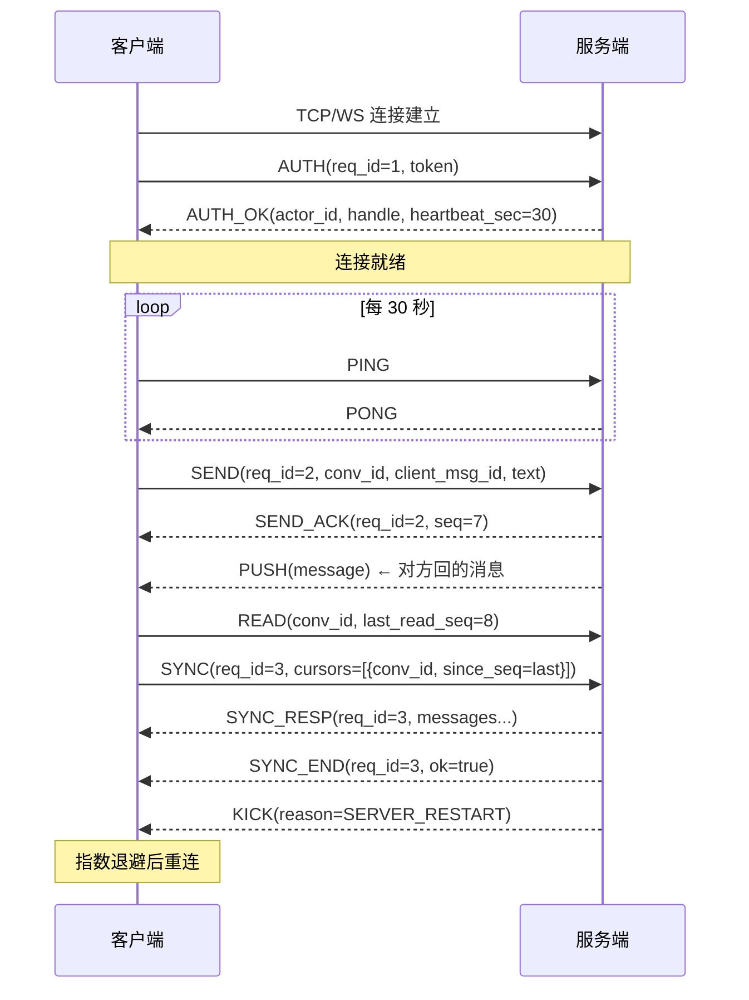

# 04 · 长连接协议（字节级）

> 长连接只做一件事：**实时收推送**。所有「写」操作仍走 REST。
> 本篇给出完整字节规范，任何语言可自行实现，**不需要官方 SDK**。

---

## 1. 传输承载

### 1.1 两种承载方式

| 场景 | 地址 | 承载 |
|---|---|---|
| 浏览器 / 移动端 | `wss://<host>:8090/ws` | **WebSocket**（二进制帧） |
| 原生程序（推荐） | `<host>:8090` | **原生 TCP** |

### 1.2 帧边界规则（关键区别）

**WebSocket 承载：**

```
一个 WebSocket 二进制消息 = 一个完整的 Frame
```

✅ **不需要额外长度前缀**——WebSocket 协议自身已有帧边界。

**原生 TCP 承载：**

```
[4 字节大端长度 N][N 字节 Frame 字节流][4 字节大端长度 M][M 字节 Frame]...
```

⚠️ TCP 是**字节流**，没有消息边界，**必须**自己加长度前缀。

示例（实测）：

```
00 00 00 32                                     ← 长度 0x32 = 50
08 0a 10 02 1a 2c 08 e9 07 12 0a 63 2d 37 66 33   ← Frame 本体
61 39 62 32 31 18 01 22 19 7b 22 74 65 78 74 22
3a 22 e4 bd a0 e5 a5 bd ef bc 8c 41 67 65 6e 74
22 7d
```

> **易错点**：长度前缀是 **Frame 的字节数（50）**，**不含** 前缀自身 4 字节。

---

## 2. Frame 结构

```protobuf
message Frame {
  Cmd    cmd     = 1;   // 字段号 1，线类型 VARINT
  uint64 req_id  = 2;   // 字段号 2，线类型 VARINT
  bytes  payload = 3;   // 字段号 3，线类型 LEN
}
```

### 2.1 命令字表（`cmd`）

| 值 | 名称 | 方向 | payload 类型 | 说明 |
|---|---|---|---|---|
| 0 | `CMD_UNKNOWN` | — | — | 保留，任何一方都不得使用 |
| 1 | `CMD_AUTH` | C→S | `AuthRequest` | 鉴权（**必须是第一帧**） |
| 2 | `CMD_AUTH_OK` | S→C | `AuthResponse` | 鉴权成功 |
| 3 | `CMD_PING` | 双向 | — | 心跳 |
| 4 | `CMD_PONG` | 双向 | — | 心跳应答 |
| 10 | `CMD_SEND` | C→S | `SendRequest` | 发消息 |
| 11 | `CMD_SEND_ACK` | S→C | `SendAck` | 发送成功回执（含最终 seq） |
| 12 | `CMD_PUSH` | S→C | `PushMessage` | 新消息推送 |
| 13 | `CMD_READ` | C→S | `ReadRequest` | 已读上报 |
| 14 | `CMD_SYNC` | C→S | `SyncRequest` | 断点续传拉取 |
| 15 | `CMD_SYNC_END` | S→C | `SyncEnd` | 续传一轮结束（仅 `has_more=false` 时发） |
| 16 | `CMD_SYNC_RESP` | S→C | `SyncResponse` | 续传响应（一次请求恰好一帧） |
| 20 | `CMD_KICK` | S→C | `KickNotice` | 强制下线 |
| 21 | `CMD_ERROR` | S→C | `ErrorFrame` | 错误（关联 req_id） |

### 2.2 `req_id` 规则

| 场景 | 值 |
|---|---|
| 客户端发起的请求 | 客户端自增（建议从 1 开始，u64 递增） |
| 服务端对请求的响应 | **原样回传**该请求的 `req_id` |
| 服务端主动推送 | `0` |

**用途**：并发请求时配对响应。因为长连接是全双工的，`req_id` 让你知道哪个响应属于哪个请求。

> 也用于 SDK 层的「同步调用」封装（把异步响应转成 Future/Promise）。

### 2.3 命令字的三条不变量（含一条真实的修正记录）

| # | 不变量 | 违反时的表现 |
|---|---|---|
| 1 | **一个命令字只有一个方向**（因此请求与响应必须是两个不同命令字） | 接收方拿到一帧无法判断是请求还是响应 |
| 2 | **一个命令字只对应一种 payload 类型，且一种 payload 只属于一个命令字** | `payload` 是 `bytes`，类型信息全靠 `cmd`；错配时 protobuf **不报错**，只把不匹配的字段当未知字段跳过 → 「解析成功但字段含义全错」 |
| 3 | **编号只增不改**：一个值一旦写进本篇，含义就冻结 | 照旧版文档实现过的接入方静默错位（新编号被当成旧语义） |

#### 修正记录：`CMD_SYNC` 的响应

早期版本里 `CMD_SYNC = 14` 一个编号承担了两个方向的两种载荷：

```
C→S  payload = SyncRequest     // 「我要补消息」
S→C  payload = SyncResponse    // 「给你补消息」
```

同一条连接上收到 `cmd=14`，接收方**没有任何依据**判断该按哪个类型解 —— 而 protobuf 又不会报错（两者都含嵌套消息字段，只是字段号不同），于是会出现「解析成功、字段为空或串位」这种最难查的现象。这一条同时违反不变量 1 与 2。

修法是**给响应一个独立编号**，而不是让实现者去猜载荷：

| | 请求 | 响应 |
|---|---|---|
| 命令字 | `CMD_SYNC` = **14** | `CMD_SYNC_RESP` = **16** |
| 方向 | C→S | S→C |
| 载荷 | `SyncRequest` | `SyncResponse` |

> **为什么是「追加 16」而不是「把 `CMD_SYNC_END` 挪到 16、响应占 15」**：
> 15 已经写在对外文档里（不变量 3）。重排会让任何一份按文档实现的客户端静默错位，
> 而追加一个新编号的代价只是表格里多一行。

#### 这三条不变量是机器校验的，不靠 reviewer 记得

| 校验内容 | 位置 |
|---|---|
| 编号/方向/载荷三方一致：`proto/transport.proto` ↔ 本篇 §2.1 ↔ 服务端 `Frames` | `tools/verify_integration_docs.py` 第 5 节 |
| 每条命令必须显式声明方向与载荷（格式写死，漏写即失败） | 同上（逐行校验 proto 的 `Cmd` 枚举） |
| 编号冻结：`CMD_SYNC=14` / `CMD_SYNC_END=15` / `CMD_SYNC_RESP=16` | `FramesTest.commandDirectionsAreDeclared` |
| 客户端发送服务端专用命令 → 40000 且说明是哪一类错 | `TwoClientEndToEndTest.serverOnlyCommandsAreRejectedAsClientMistakes` |
| 请求与响应不会用到同一个编号 | `FramesTest.syncResponseHasItsOwnCommandWord` |

#### 客户端必须做到的两件事

1. **不要回显服务端帧**。`CMD_AUTH_OK`/`CMD_SEND_ACK`/`CMD_PUSH`/`CMD_SYNC_RESP`/`CMD_SYNC_END`/`CMD_KICK`/`CMD_ERROR` 都只由服务端发出；
   发过去会得到 `40000`（服务端能明确指出「这是服务端专用命令」，而不是含混的「未知命令」）。
2. **按命令字解码，不要按「猜」**。`payload` 里没有类型信息，`cmd` 是唯一依据；
   解不出来就是协议实现错了，应该当作致命错误处理，不要用默认值堆过去。

---

## 3. Flutter/浏览器要实现 protobuf 吗？

**要，但如果不想实现，见 §8 的替代方案。**

protobuf 线格式其实很简单，只有 3 种编码需要实现：

### 3.1 varint 编码（用于 `cmd`、`req_id` 等整数）

规则：每字节低 7 位是数据，最高位（bit 7）表示「还有后续字节」。

实测对照表（**自己实现的黄金测试用例**）：

| 值 | 编码（hex） | 字节数 |
|---|---|---|
| 1 | `01` | 1 |
| 2 | `02` | 1 |
| 10 | `0a` | 1 |
| 127 | `7f` | 1 |
| 128 | `80 01` | 2 |
| 300 | `ac 02` | 2 |
| 1001 | `e9 07` | 2 |
| 16384 | `80 80 01` | 3 |

**编码算法：**

```python
def encode_varint(n: int) -> bytes:
    out = bytearray()
    while True:
        b = n & 0x7F
        n >>= 7
        if n:
            out.append(b | 0x80)
        else:
            out.append(b)
            return bytes(out)
```

**解码算法：**

```python
def decode_varint(buf: bytes, i: int):
    val = 0
    shift = 0
    while True:
        b = buf[i]; i += 1
        val |= (b & 0x7F) << shift
        if not (b & 0x80):
            return val, i
        shift += 7
```

### 3.2 tag 编码

```
tag = (字段号 << 3) | 线类型
```

| 线类型 | 值 | 用于 |
|---|---|---|
| VARINT | 0 | int32/int64/uint32/uint64/bool/enum |
| I64 | 1 | fixed64/double |
| LEN | 2 | string/bytes/嵌套消息 |
| I32 | 5 | fixed32/float |

实测：

| 字段 | 线类型 | tag（十进制） | tag（hex） |
|---|---|---|---|
| 1 | VARINT | 8 | `08` |
| 2 | VARINT | 16 | `10` |
| 3 | LEN | 26 | `1a` |
| 4 | LEN | 34 | `22` |

### 3.3 Frame 的完整手写编解码

```python
# ---------- 编码 ----------
def encode_frame(cmd: int, req_id: int, payload: bytes) -> bytes:
    out = bytearray()
    # 字段 1: cmd (VARINT)
    out += bytes([(1 << 3) | 0]) + encode_varint(cmd)
    # 字段 2: req_id (VARINT)
    out += bytes([(2 << 3) | 0]) + encode_varint(req_id)
    # 字段 3: payload (LEN)
    if payload:
        out += bytes([(3 << 3) | 2]) + encode_varint(len(payload)) + payload
    return bytes(out)

# ---------- 解码 ----------
def decode_frame(buf: bytes) -> dict:
    i = 0
    frame = {"cmd": 0, "req_id": 0, "payload": b""}
    while i < len(buf):
        tag, i = decode_varint(buf, i)
        field, wire = tag >> 3, tag & 0x07
        if wire == 0:
            v, i = decode_varint(buf, i)
            if field == 1: frame["cmd"] = v
            elif field == 2: frame["req_id"] = v
        elif wire == 2:
            ln, i = decode_varint(buf, i)
            data = buf[i:i + ln]; i += ln
            if field == 3: frame["payload"] = data
        else:
            raise ValueError(f"unsupported wire type {wire}")
    return frame
```

---

## 4. 逐字节示例（实测，可用来自测）

### 4.1 AUTH 帧（55 字节）

```
08 01 10 01 1a 31 0a 18 73 6b 5f 6c 69 76 65 5f
39 66 32 63 31 64 37 61 34 62 38 65 33 66 36 30
12 05 31 2e 30 2e 30 1a 0e 77 65 62 2d 63 68 72
6f 6d 65 2d 31 33 31
```

**逐字段解析：**

```
Frame 层：
  08 01       字段1 cmd    = 1   (CMD_AUTH)
  10 01       字段2 req_id = 1
  1a 31       字段3 payload, LEN=0x31=49 字节

payload（AuthRequest）展开：
  0a 18 73 6b 5f ...    字段1 token, LEN=0x18=24 → "sk_live_9f2c1d7a4b8e3f60"
  12 05 31 2e 30 2e 30  字段2 client_version, LEN=5 → "1.0.0"
  1a 0e 77 65 62 2d ... 字段3 device_id, LEN=0x0e=14 → "web-chrome-131"
```

### 4.2 SEND 帧（50 字节）

```
08 0a 10 02 1a 2c 08 e9 07 12 0a 63 2d 37 66 33
61 39 62 32 31 18 01 22 19 7b 22 74 65 78 74 22
3a 22 e4 bd a0 e5 a5 bd ef bc 8c 41 67 65 6e 74
22 7d
```

**逐字段解析：**

```
Frame 层：
  08 0a       字段1 cmd    = 10  (CMD_SEND)
  10 02       字段2 req_id = 2
  1a 2c       字段3 payload, LEN=0x2c=44 字节

payload（SendRequest）展开：
  08 e9 07              字段1 conv_id        = 1001
  12 0a 63 2d ...       字段2 client_msg_id  = "c-7f3a9b21" (10 字节)
  18 01                 字段3 msg_type       = 1 (TEXT)
  22 19 7b 22 ...       字段4 content_json   = {"text":"你好，Agent"} (25 字节)
```

> **注意 `content_json` 是 25 字节**，不是字符数。中文 UTF-8 占 3 字节：
> `你`(3) + `好`(3) + `，`(3) + `Agent`(5) + 结构 11 = 25。
> 这正是必须由工具生成而非手算的原因。

### 4.3 SEND_ACK 帧（40 字节）

```
08 0b 10 02 1a 22 08 e9 07 10 07 18 81 80 a4 f0
9d e4 de 90 0a 20 fb d0 ea b6 b7 33 2a 0a 63 2d
37 66 33 61 39 62 32 31
```

```
Frame 层：
  08 0b        cmd    = 11 (CMD_SEND_ACK)
  10 02        req_id = 2   ← 与 SEND 的 req_id 相同，用于配对
  1a 22        payload LEN=0x22=34

payload（SendAck）：
  08 e9 07        conv_id = 1001
  10 07           seq = 7        ★ 服务端分配的最终序号
  18 81 80 ...    message_id = 730000000000000001 (varint, 9 字节)
  20 fb d0 ...    created_at_ms = 1767225600123
  2a 0a 63 2d...  client_msg_id = "c-7f3a9b21"
```

> `message_id` 是雪花 ID（约 7.3×10^17），varint 编码后是 9 字节，
> 这让整帧比用固定 8 字节还多 1 字节——**大整数用 varint 不一定省**，但这是 protobuf 的默认行为。

### 4.4 PUSH 帧（70 字节）

```
08 0c 1a 42 0a 40 08 82 80 a4 f0 9d e4 de 90 0a
10 e9 07 18 08 20 d2 0f 28 01 32 23 7b 22 74 65
78 74 22 3a 22 e6 94 b6 e5 88 b0 ef bc 8c e4 bb
8a e5 a4 a9 e5 8c 97 e4 ba ac e6 99 b4 22 7d 40
c8 d3 ea b6 b7 33
```

```
Frame 层：
  08 0c        cmd    = 12 (CMD_PUSH)
  （无 req_id！服务端主动推送时为 0，protobuf 默认值不编码 → 直接省略）
  1a 42        payload LEN=0x42=66

payload（PushMessage）：
  0a 40 ...    字段1 message, LEN=0x40=64
                └─ 内嵌 Message 消息
```

> **重要观察**：`req_id=0` 时字段**完全不出现**（protobuf3 默认值不编码）。
> 你的解码器必须能处理「字段缺失」，用默认值 0 补齐。

### 4.5 SYNC_RESP 帧（123 字节）

重连后补齐丢失消息的响应（§6）。注意命令字是 **16**，不是 14 —— 14 只用于客户端发出的 `SyncRequest`（§2.3）。

```
08 10 10 03 1a 75 0a 40 08 82 80 a4 f0 9d e4 de
90 0a 10 e9 07 18 08 20 d2 0f 28 01 32 23 7b 22
74 65 78 74 22 3a 22 e6 94 b6 e5 88 b0 ef bc 8c
e4 bb 8a e5 a4 a9 e5 8c 97 e4 ba ac e6 99 b4 22
7d 40 c8 d3 ea b6 b7 33 0a 31 08 83 80 a4 f0 9d
e4 de 90 0a 10 e9 07 18 09 20 e9 07 28 01 32 14
7b 22 74 65 78 74 22 3a 22 e6 98 8e e5 a4 a9 e8
a7 81 22 7d 40 95 d6 ea b6 b7 33
```

```
Frame 层：
  08 10        cmd    = 16 (CMD_SYNC_RESP)
  10 03        req_id = 3    ← 与客户端发出的 CMD_SYNC 相同
  1a 75        payload LEN=0x75=117

payload（SyncResponse）：
  0a 40 ...    字段1 messages，第 1 条，LEN=0x40=64
                └─ 与 §4.4 PUSH 里那条完全相同的 Message（seq=8）
  0a 31 ...    字段1 messages，第 2 条，LEN=0x31=49
                ├─ 08 83 80 ...  message_id = 730000000000000003
                ├─ 10 e9 07     conv_id = 1001
                ├─ 18 09        seq = 9        ★ 必须严格递增
                ├─ 20 e9 07     sender_id = 1001
                ├─ 28 01        msg_type = 1 (TEXT)
                ├─ 32 14        content_json LEN=0x14=20 → {"text":"明天见"}
                └─ 40 95 d6 ... created_at_ms = 1767225600789
  字段2 has_more 与 字段3 truncated 都是 false
  → （protobuf3 默认值不编码，两个字段完全不出现；解码时必须当作 false）
```

> **为什么 `has_more` / `truncated` 一个字节都没有？** protobuf3 **不编码默认值**（`false`），
> 「没出现」就等于 `false`。这必须当真处理：把缺失当成「不知道」会让客户端行为不确定，
> 而把 `truncated` 的缺失当成 `true`，会把所有客户端都送去走 REST 补拉。
> §4.4 的 `req_id=0`（字段消失）是同一个机制，不是特例。

### 4.6 SYNC_END 帧（10 字节）

```
08 0f 10 03 1a 04 08 01 18 02
```

```
Frame 层：
  08 0f        cmd    = 15 (CMD_SYNC_END)
  10 03        req_id = 3    ← 与上面那帧相同
  1a 04        payload LEN=4

payload（SyncEnd）：
  08 01        ok = true
  （message 为空字符串 → 不编码）
  18 02        conv_synced = 2   ← 本轮补齐的会话数
```

> 这两帧是**一对**：`CMD_SYNC_RESP(16)` 带消息，`CMD_SYNC_END(15)` 带「这轮完了」。
> 它们共用同一个 `req_id`，且都不属于客户端可发送的方向。

---

## 5. 连接生命周期

### 5.1 完整时序



### 5.2 握手（必须按顺序）

```
1. 建立 TCP/WebSocket 连接
2. 客户端立即发送 AUTH 帧
3. 服务端校验
   ├─ 成功 → 回 AUTH_OK，连接进入就绪态
   └─ 失败 → 回 ERROR，然后【服务端主动关闭连接】
4. 若 5 秒内未收到 AUTH 帧，服务端主动断开
```

> **超时保护**：服务端对未鉴权连接有 5 秒超时，防止连接资源被空占。

### 5.3 心跳

| 参数 | 值 |
|---|---|
| 客户端发送 PING 间隔 | `heartbeat_sec`（AUTH_OK 返回，默认 30 秒） |
| 服务端 idle 判定 | 60 秒无任何数据 |
| 服务端断开阈值 | 90 秒无任何数据 |

**规则：**

- 任一方收到 `PING` → 立即回 `PONG`
- 客户端也可以用任何帧代替 PING（有数据即视为活跃）
- 客户端若 90 秒没收到任何服务端数据 → 认为连接已死，主动重连

> **不要只依赖 TCP keepalive**。中间设备（NAT、LB）会静默切断闲置连接，
> 应用层心跳是唯一可靠的存活检测。

### 5.4 强制下线（KICK）

```protobuf
KickNotice {
  reason: 3,                        // 3 = SERVER_RESTART
  detail: "server restarting",
  retry_after_ms: 2000
}
```

| reason | 含义 | 客户端应做 |
|---|---|---|
| 1 | `OTHER_DEVICE` | 提示「已在其他设备登录」，停止重连 |
| 2 | `SUSPENDED` | 提示账号被停用，停止重连 |
| 3 | `SERVER_RESTART` | **按 `retry_after_ms` 退避重连** |
| 4 | `AUTH_EXPIRED` | 刷新 token 后重连 |

---

## 6. 断点续传（核心机制）

> ✅ **服务端读取路径已实现**（DESIGN §10.2）。本节描述的字段、方向与载荷已冻结（§2.3，有机器校验），
> 客户端按本节实现即可，不需要在“服务端还没做”这件事上做任何兼容分支。

### 6.0 服务端的行为承诺

下面每一条都是**可验证**的（右列是钉住它的测试用例，`tools/verify_integration_docs.py` 会检查
这些用例名真的存在——文档引用在代码里找不到的用例，也是一类漂移）。

| 服务端承诺 | 具体含义 | 钉住它的用例 |
|---|---|---|
| 只按 `seq > since_seq` 查 | 与断线时长、消息产生时间完全无关（§6.3） | `MessageSyncIT.syncReturnsExactlyTheMissingRangeInOrder` |
| 每会话最多 `limit` 条 | 客户端传的 `limit` 会被收敛到 `tm.message.max-pull-size`（默认 200） | `MessageServiceTest.syncClampsPageSize` |
| `has_more` 是精确值 | 服务端会多读一行来判断「还有没有」，不是估计值 | `MessageServiceTest.syncReportsHasMoreByFetchingOneExtraRow` |
| `has_more=true` 时本帧必有消息 | 客户端总能把游标往前推，不会死循环 | `MessageServiceTest.syncReportsHasMoreByFetchingOneExtraRow` |
| `has_more=true` 时**不发** `SYNC_END` | 否则客户端会以为已追平（§6.2） | `TwoClientEndToEndTest.syncDoesNotSendEndWhileMoreRoundsArePending` |
| 补齐时 `SYNC_RESP` 后紧跟一帧 `SYNC_END` | 两帧 `req_id` 相同，且落在同一个 TCP 段里 | `TwoClientEndToEndTest.syncDeliversTheGapAndEndsTheRound` |
| 一次最多带 N 个会话游标 | 超出回 `40002` 并要求分批（`tm.message.max-cursors-per-sync`，默认 50） | `MessageServiceTest.syncRejectsTooManyCursors` |
| 非成员/已不存在的会话被跳过 | 整轮不因它失败；被跳过的会话在 `SYNC_END.message` 里点名 | `MessageSyncIT.nonMemberCursorIsSkippedWithoutLeakingItsMessages` |
| 失败时回 `CMD_ERROR`（可重试） | 不会静默回一帧空结果：假成功比报错危险得多 | `TwoClientEndToEndTest.syncFailureIsReportedInsteadOfSilentSuccess` |
| `truncated` 目前恒为 `false` | 服务端还没做归档，没有依据说「补不齐」（§6.4） | `MessageSyncIT.seqHolesAreLegalAndAreNotReportedAsTruncation` |

服务端的实现取舍（为什么是「多读一行」而不是查 `max_seq`、为什么非成员游标只跳过不报错、
为什么 `truncated` 不能从「某行不存在」反推）写在 DESIGN §10.2——那是服务端自己需要解释的东西，
接入方只需依赖上表。

### 6.1 客户端需要持久化的唯一状态

**每个会话一个整数**：最后处理到的 `seq`。

```json
{ "1001": 7, "1002": 23 }
```

### 6.2 重连后的同步流程

```
1. 重连 + AUTH
2. 构造 SYNC 请求，带上所有会话的 last_seq
3. 服务端按 (conv_id, seq) 升序返回缺失消息（一帧 CMD_SYNC_RESP）
4. 若 has_more=true，按 §6.5 推进游标（每个会话推到本帧里**该会话**最后一条的 seq）后继续发 SYNC，直到 false
5. 收到 SYNC_END 后，恢复正常实时接收
```

**请求（`CMD_SYNC` = 14，C→S，载荷 `SyncRequest`）：**

```protobuf
SyncRequest {
  cursors: [
    { conv_id: 1001, since_seq: 7 },     // 只要 seq > 7 的消息
    { conv_id: 1002, since_seq: 23 }
  ],
  limit: 200
}
```

> **两个请求侧的约束**（本地会话很多的客户端需要知道）：
> 游标数不能超过 `tm.message.max-cursors-per-sync`（默认 50，超出回 `40002` 并要求分批），
> 同一个 `conv_id` 不能出现两次（回 `40002`——「该按哪个游标算」没有定义，服务端不会替你挑一个）。
> 分批时各批互不影响：每批有自己的 `has_more` 与自己的一对 `SYNC_RESP`/`SYNC_END`。

**响应（`CMD_SYNC_RESP` = 16，S→C）：一次请求恰好收到一帧**，`req_id` 原样回传：

```protobuf
Frame {
  cmd: 16,                          // CMD_SYNC_RESP（不是 14——见 §2.3）
  req_id: <原样回传>,
  payload: SyncResponse {
    messages: [ /* 按 (conv_id, seq) 升序 */ ],
    has_more: false,
    truncated: false
  }
}
```

| 响应字段 | 客户端应做 |
|---|---|
| `has_more = true` | 按 §6.5 推进游标后再发一次 `CMD_SYNC`（本帧一定至少有一条消息，所以循环必然收敛） |
| `has_more = false` | 紧接着会收到一帧 `CMD_SYNC_END`，此后恢复正常接收 |
| `truncated = true` | 服务端补不齐（超出消息保留期），改用 REST 拉历史（§6.4） |

> **载荷缺失不等于解析失败**：当本轮没有任何消息、且 `has_more`/`truncated` 都是默认值（`false`）时，
> 整个 `SyncResponse` 的字段都是默认值，而 proto3 不编码默认值——线上就是<b>没有 `payload` 字段</b>。
> 最正常的「没什么要补」就是这个形状，客户端必须把它当成空的 `SyncResponse`
> （拿不到 `payload` 时按「空消息 + `has_more=false`」处理）。由
> `TwoClientEndToEndTest.syncReportsSkippedCursorsInTheEndFrame` 钉住这一形状。

```protobuf
Frame {
  cmd: 15,                              // CMD_SYNC_END
  req_id: <与上面那帧相同>,
  payload: SyncEnd { ok: true, conv_synced: 2 }
}
```

> **`CMD_SYNC_END` 只在 `has_more=false` 时出现。** `has_more=true` 时不得发它——
> 否则客户端会在还没补齐的情况下以为已经追平，接着开始接收实时推送，
> 而中间缺的那段再也没人补。
>
> **命名提醒：**`CMD_SYNC`（14，C→S）是「我来拉」，`CMD_SYNC_RESP`（16，S→C）是「给你」，
> `CMD_SYNC_END`（15，S→C）是「这轮完了」。三者方向固定，不存在同一编号双向的情况。

### 6.3 为什么不会丢消息

服务端只按 **`seq > since_seq`** 查询，与断线时长、消息产生时间**完全无关**。

```
断线期间产生 seq=8,9,10；客户端 last_seq=7
重连 SYNC(since_seq=7) → 返回 8,9,10   ✓ 一条不漏
```

### 6.4 服务端截断（`truncated`）

`truncated = true` 的含义是「你要的区间里有一部分服务端已经给不出来了」，此时客户端应改用 REST 拉历史：

```http
GET /v1/conversations/1001/messages?limit=200&cursor=...
```

**当前实现不会置位它，这是刻意的**：`seq` 在会话内允许有空洞（发消息时「取号即消耗」，
重试、对账都会留下空洞），所以「某一行不存在」推不出「已被删除」——把空洞当成截断，
客户端会去做一次没有意义的 REST 重拉（拿到的是同一批消息）。
真正能回答「补得齐吗」的只有归档/清理任务的**水位**（「本会话 `seq <= N` 的消息已归档」）；
它落地后，服务端才应据此置位。在此之前，SYNC 返回的就是库里现存的全部消息——
所谓「保留期」目前由归档任务定义，而它尚未上线。

### 6.5 推进游标的规则（最容易写错的一处）

客户端为每个会话维护的 `last_seq` 语义必须精确：
**「`seq <= last_seq` 的消息我已经全部处理完」**。由此推出三条处置：

| 情况 | 该做什么 |
|---|---|
| `seq <= last_seq` | 忽略：重复投递，去重即可 |
| `seq == last_seq + 1` | 处理它，`last_seq = seq` |
| `seq > last_seq + 1`（中间有洞） | **先补洞**：用当前 `last_seq` 发一次 `SYNC`，把整段补齐后再推进 |

为什么第三条必须这样：`seq` 允许有空洞，而**客户端分不清「这个号从来没用过」与「有这个号只是我没收到」**。
把游标直接跳到洞后面的序号，等于把「没收到」判成「不存在」——那条消息再也不会被补回来。
宁可多拉一次（最坏拿到一帧空响应，只花一个往返）。

反过来，服务端给的两条保证让这个循环必然收敛：`seq > last_seq` 的消息一条都不会少（§6.3），
且 `has_more=true` 时本帧一定有消息可以推进游标（§6.0）。

---

## 7. 客户端实现要点清单

| # | 要点 | 说明 |
|---|---|---|
| 1 | **区分两种承载** | WebSocket 无长度前缀；TCP 必须 4 字节大端前缀 |
| 2 | **处理字段缺失** | protobuf3 默认值不编码，`req_id=0` 时字段不出现 |
| 3 | **AUTH 必须第一帧** | 5 秒超时会被断开 |
| 4 | **req_id 配对** | 并发请求靠它区分响应；推送的 req_id 恒为 0 |
| 5 | **按 seq 去重，但别把 last_seq 当成水位** | 已处理过的 `seq` 直接忽略；但「当前游标」是「连续处理到哪」，不是「见过的最大号」——`PUSH` 可丢，`seq > last_seq + 1` 说明中间有洞，要用 `last_seq` 发一次 `SYNC`（§6.5） |
| 6 | **持久化 last_seq** | 每个会话一个整数，本地落盘 |
| 7 | **应用层心跳** | 不要依赖 TCP keepalive |
| 8 | **指数退避重连** | 1s → 2s → 4s → … 上限 30s，加抖动 |
| 9 | **识别 KICK** | 不同 reason 处理策略不同，不要盲目重连 |
| 10 | **UTF-8 长度按字节算** | 中文 3 字节，LEN 是字节数不是字符数 |
| 11 | **不要回显服务端帧** | `CMD_PUSH`/`CMD_SYNC_RESP`/`CMD_SYNC_END` 等只由服务端发出，发过去会得 40000（§2.3） |

### 7.1 重连退避参考实现

```python
import random, time

def backoff_sequence(base=1.0, cap=30.0, jitter=0.3):
    """1, 2, 4, 8, 16, 30, 30... 加上 ±30% 抖动（防惊群）"""
    n = 0
    while True:
        delay = min(cap, base * (2 ** n))
        yield delay * (1 + random.uniform(-jitter, jitter))
        n += 1
```

> **抖动（jitter）不是可选项**。服务端重启时，若所有客户端同时按相同间隔重连，
> 会造成「惊群」——瞬间打满服务端。

---

## 8. 不想实现 Protobuf？用 REST 轮询代替

如果你不想实现 protobuf 编解码，**完全可以不用长连接**。

用 REST 增量拉取 + 轮询：

```python
import time, httpx

cursors = {1001: 0, 1002: 0}   # 本地持久化

while True:
    for conv_id, last_seq in list(cursors.items()):
        r = httpx.get(
            f"http://localhost:8080/v1/conversations/{conv_id}/messages",
            params={"since_seq": last_seq, "limit": 200},
            headers={"Authorization": f"Bearer {API_KEY}"},
            timeout=10,
        )
        data = r.json()["data"]
        for msg in data["items"]:
            handle(msg)                      # seq 升序
            cursors[conv_id] = msg["seq"]
        # 有更多就立即继续，不要睡
        while data["has_more"]:
            r = httpx.get(..., params={"since_seq": cursors[conv_id]})
            data = r.json()["data"]
            for msg in data["items"]:
                handle(msg)
                cursors[conv_id] = msg["seq"]

    time.sleep(2)   # 轮询间隔
```

**代价对比：**

| | 长连接 | REST 轮询 |
|---|---|---|
| 实时性 | 毫秒级 | 轮询间隔（如 2 秒） |
| 服务端压力 | 低（推送时才消耗） | 高（空轮询也消耗） |
| 实现复杂度 | 中（需 protobuf） | **低（只需 HTTP+JSON）** |
| 适用 | 高并发、实时聊天 | 验证、低频、Serverless |

> **建议**：先跑通 REST，确认业务逻辑正确，再按需升级到长连接。
> 两者的**语义完全一致**（同样的 `seq`、同样的幂等），所以升级不会破坏已有代码。
